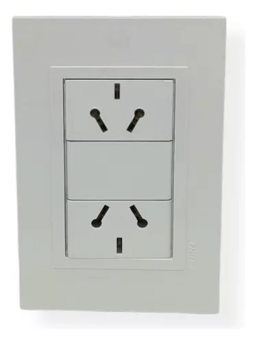
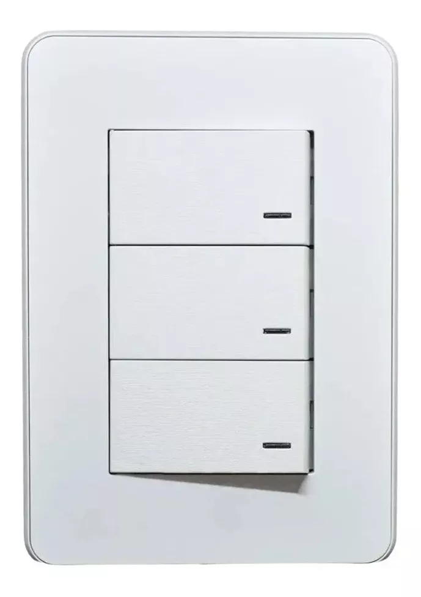
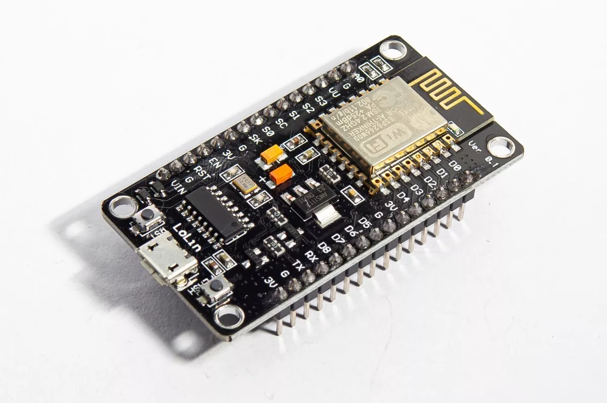
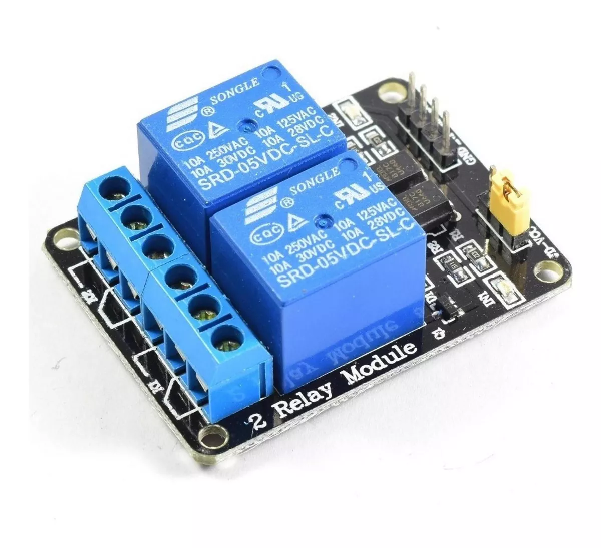
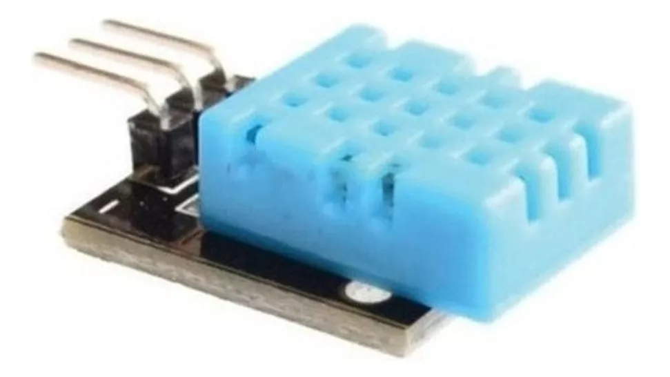

# Descripción del proyecto Libre-Gallinero

## Visión General
Se automatiza el control lumínico de aves de corral, especializado en gallinas ponedoras.

## Hardware

Existe un dispositivo armado dentro de un táper de helado,  
necesita de energía eléctrica para funcionar,  
y también necesita WiFi para informar cosas y para saber qué hora es cuando enciende luego de un corte de electricidad.

El mismo tiene 2 enchufes (tomas de corriente) comunes, donde se deben conectar:
- La lámpara de las Gallinas
- La lámpara infrarroja o calentador eléctrico de los pollitos 

## Software

### Lógica para las gallinas

La lámpara de luz pretende simular los horarios de verano, para una Latitud preconfigurada.  

En otras palabras, el relé que activa el enchufe donde está conectada la lámpara de la gallina, es un relé `normal cerrado`. El mismo se activa en dos momentos del día:
- Cuando es la hora del amanecer en verano, y se debe desactivar cuando amanece en la fecha actual.
- Cuando es la hora del atardecer en la fecha actual, y se debe desactivar cuando atardece en verano.

### Lógica para los pollitos

El sensor de temperatura está afuera, en un ambiente despejado, captando la temperatura ambiente. El mismo está conectado a un relé `normal abierto` que maneja el enchufe donde está la lámpara de los pollitos.

- Cuando la temperatura ambiente es mayor a 28°C, entonces se activa el relé, apagando la calefacción a los pollitos.

### Informes

Se mantiene informado en un sitio web el estado de las lámparas, con su respectivo timestamp de manera legible.

### Inicio del dispositivo

Cuando el microcontrolador se prende, trata de escablecer conexión con la red WiFi preconfigurada. Una vez que consigue conexión, actualiza la hora actual a través del protocolo NTP.

Si no consigue conexión, entonces crea un hotspot de configuración. Mientras sigue verificando conectarse, periódicamente.  

Una vez que obtuvo la hora, se pretende que el microcontrolador administre la hora y fecha actual, e inicie los procesos que cumplen la finalidad del dispositivo.

### Hotspot de configuración

Consiste armar un AccessPoint WiFi con el microcontrolador. Además debe servir un sitio web con 2 campos de formulario:
- Nombre de la Wifi
- Contraseña

Estos campos los toma, y almacena no-volátilmente el microcontrolador, para encolarlo en la verificación cotidiana (preconfiguración wifi)

La configuración de IP del AP debe prometer que siempre se halle este servicio web en la ubicación `1.1.1.1`, solo para la red local. Si no es posible, entonces `192.168.0.1`

Es importante que mientras este servicio corre, se pueda seguir verificando si conecta a la WiFi preconfigurada.

### Componentes

| Componente         | Imagen                                                                                   |
| ------------------ | ---------------------------------------------------------------------------------------
| Tomas de corriente |                |- |
| Conectores Dupont  |                 |
| NodeMCU ESP8266    |         |
| Módulo de relés    |                   |
| Sensor DHT11       |               |

